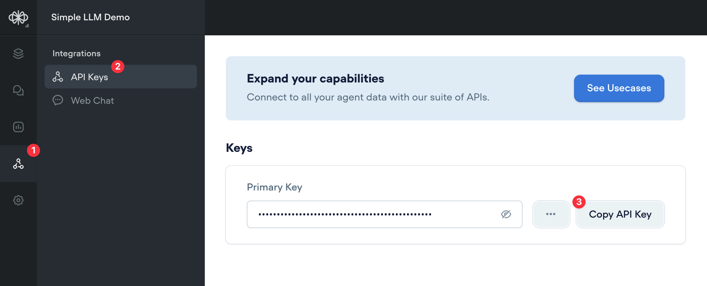
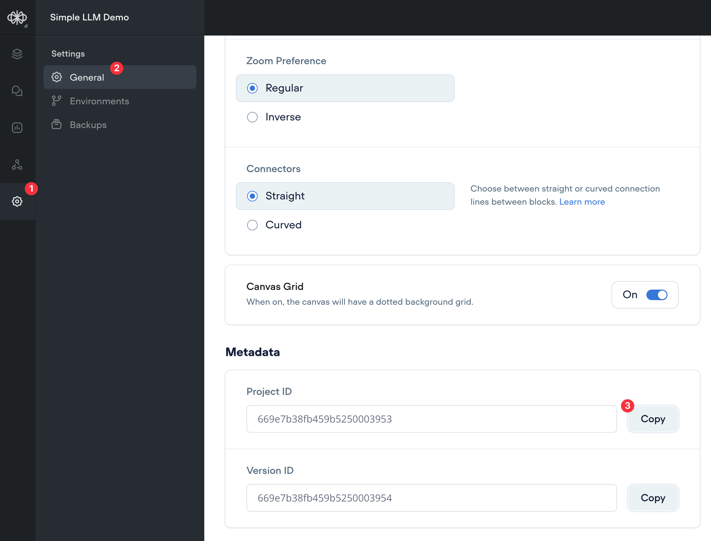
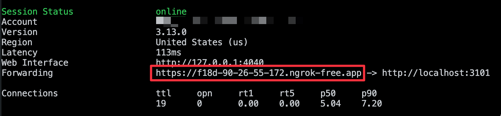

# Voiceflow Custom LLM integration

## STEP 1: SETUP THE INTEGRATION
#### Create the .env file

``` bash
cp .env.template .env
```

Open your Voiceflow agent and be sure to test the **Agent** demo at least once to compile the version if your **VOICEFLOW_VERSION_ID** is set to **development**, or to click on the **Publish** button if you've set the **VOICEFLOW_VERSION_ID** to **production**.

Retrieve the **Voiceflow API key** from the Voiceflow integrations view.


Retrieve the Voiceflow **project ID** from the Voiceflow settings view.



Update the .env file with your **Voiceflow API key** and **project ID**.

#### Start ngrok on your port

``` bash
ngrok http 3101
```

Save the ngrok forwarding url for next step to update the Custom LLM endpoint in the VAPI assistant.



#### Run the setup script

``` bash
npm run setup
```

#### Start the server

``` bash
npm run start
```

## STEP 4: Add the Custom LLM endpoint in Brave


